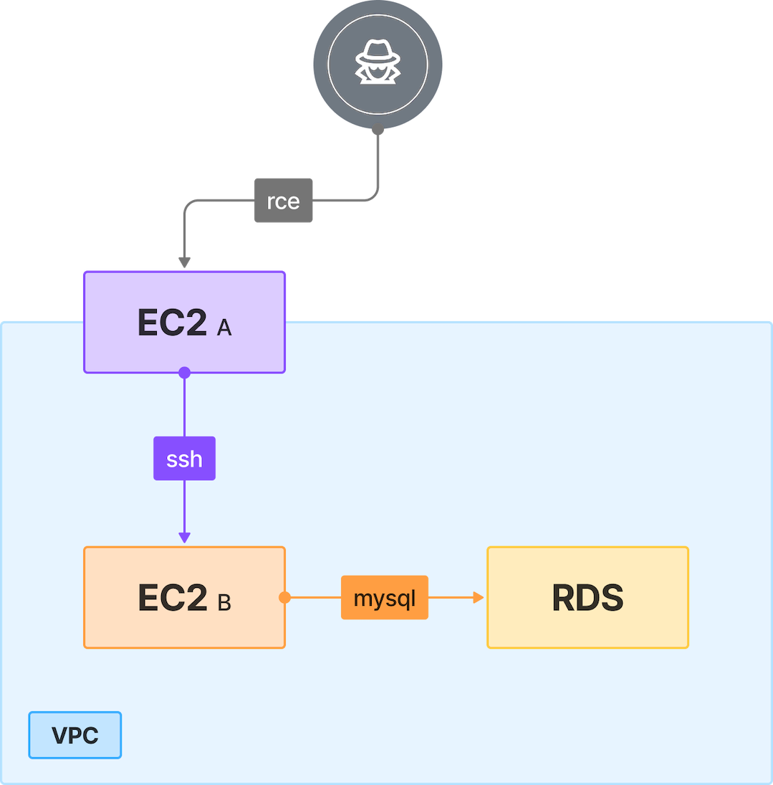

# 1. EC2 to RDS Pivot

## 🗺️ Overview
This scenario demonstrates a multi-stage AWS compromise in which an attacker exploits a remote code execution vulnerability in a public web application hosted on EC2-A. Leveraging the instance’s IAM role credentials obtained from the metadata service, they enumerate the environment and identify a private EC2 instance (EC2-B). By injecting an SSH key or initiating an SSM session, they pivot into EC2-B, where they uncover credentials and connection details for an RDS MySQL database. Using this access, the attacker connects to the database and exfiltrates sensitive data. This exercise highlights how exposed services, weak segmentation between public and private resources, and over-permissive IAM roles can be chained together, public exposure, IAM credential misuse, and poor network design, culminating in full compromise of sensitive information inside AWS.

&nbsp;

## 🧩 Required Resources

**Networking**
- 1 VPC, single region
- Subnets - 1 private, 1 public (public subnet assigned to EC2-A)
- Internet Gateway - attached to VPC
- Security Groups
  - allow HTTP (80) from internet to EC2-A
  - allow SSH (22) from EC2-A to EC2-B
  - allow MySQL (3306) from EC2-B to RDS

**Compute**
- EC2-A - Public web server (vulnerable web application, internet-facing)
- EC2-B - Internal instance, reachable only from EC2-A, local subnet

**Database / Storage**
- RDS MySQL - Internal database storing sensitive data

**IAM / Identities & Access**
- EC2-A role - Includes permissions that allow enumeration and pivoting

&nbsp;

## 🎯 Scenario Goals
The attacker’s objective is to compromise an internet-exposed EC2 instance, use its permissions to gain access to an internal EC2 host, and ultimately reach an RDS database to exfiltrate sensitive data stored within it.

&nbsp;

## 🖼️ Diagram


&nbsp;

## 🗡️ Attack Walkthrough
- **Initial Access** – Exploit a vulnerable web application on EC2-A to achieve remote code execution.
- **Credential Harvesting** – Obtain IAM role credentials from the instance metadata service.
- **Enumeration** – Use the stolen credentials to list EC2 instances and identify EC2-B within the VPC.
- **Pivoting** – Push an SSH public key via EC2 Instance Connect to gain access to EC2-B.
- **Database Access** – Extract RDS connection details from EC2-B for credentials exfiltration.
- **Data Retrieval** – Connect to the RDS MySQL database and retrieve the sensitive data.

&nbsp;

## 📈 Expected Results
**Successful Completion**
- Sensitive data retrieved from RDS.

**Detection Oportunities**
- SSH key injection to EC2b
- abnormal connection to RDS
- Abnormal usage of IMDS belongs to EC2a

&nbsp;

## 🚀 Getting Started

#### Install Dependencies

MacOS
```bash
brew install terraform awscli jq
```
Linux
```bash
sudo apt update && sudo apt install -y terraform awscli jq
```

#### Deploy

Before deploying, download the provided Terraform configuration and Attack Script to the machine where you will run the attack steps.

Use the provided Terraform configuration to deploy the full lab environment.

At the end of the deployment Terraform will display output values (e.g. public IP address of the target instance). Save these details, you will need them to run the attack script in the next stage.

⚠️ When a scenario’s initial step targets a public IP, add the public IP (or CIDR) of the machine that will run the attack script to the environment whitelist via terraform apply so the script can reach the target and complete any required interactions. See example

```bash
terraform init
terraform apply -var='attack_whitelist=["87.68.140.7/32","203.0.113.0/24"]' -auto-approve
```

#### Attack Execution
Execute the attack script from your local terminal and use the output values provided at the end of the deployment as input parameters.

```bash
chmod +x attack.sh
./attack.sh
```

#### 🧹 Clean Up
When you are finished, destroy all resources to avoid ongoing costs. This will tear down the entire lab environment including all compute, networking, and IAM components created during deployment.
Use the following command for a full cleanup

```bash
terraform destroy -var='attack_whitelist=[]' -auto-approve
```
