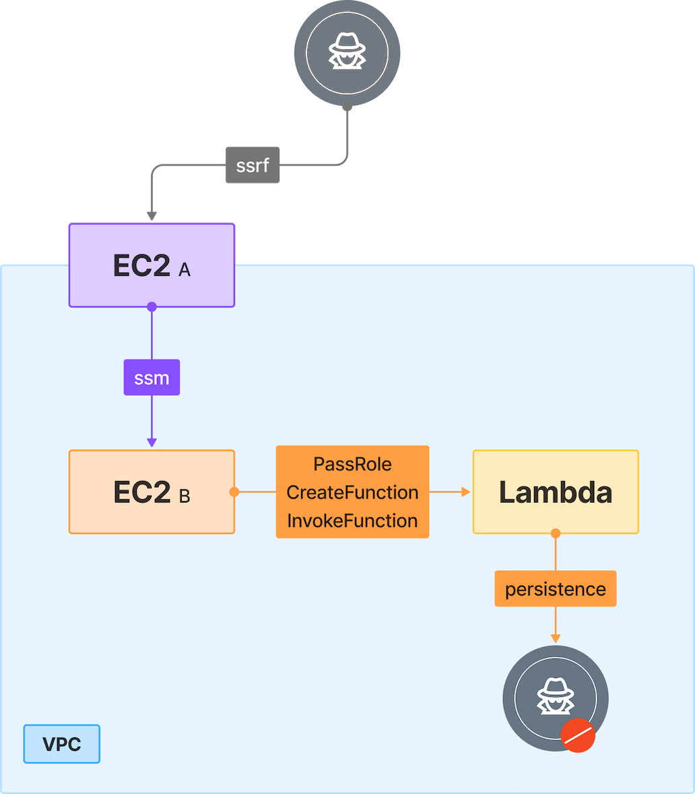

# 2. SSRF to Lambda Privilege Escalation

## 🗺️ Overview
This scenario demonstrates how an attacker can chain a vulnerability in a public-facing EC2 instance with overly permissive IAM and Lambda roles to achieve full AWS account takeover. The attack begins with exploitation of an SSRF vulnerability in EC2-A’s web application to access the Instance Metadata Service (IMDSv2) and steal temporary IAM role credentials. With these credentials, the attacker pivots into an internal EC2-B via AWS Systems Manager (SSM), then abuses excessive permissions, specifically iam:PassRole, lambda:CreateFunction and lambda:InvokeFunction, to create and invoke a malicious Lambda function with AdministratorAccess. The Lambda is used to assign administrative privileges to a new IAM user under the attacker’s control, granting persistent, account-wide access. This exercise highlights the dangers of SSRF exploitation, weak IAM hygiene, and privilege escalation through misconfigured Lambda execution roles.

&nbsp;

## 🧩 Required Resources

**Networking**
- 1 × VPC (single region)
- Subnets - 1 private, 1 public (EC2-A in public, EC2-B in private)
- Internet Gateway - attached to VPC

**Compute**
- EC2-A - Publicly accessible, hosts vulnerable web application
- EC2-B - Internal host, accessible only via SSM

**Serverless**
- Lambda - Deployed by attacker for privilege escalation

**IAM / Identities & Access**
- EC2-A role - ssm:StartSession, ssm:SendCommand
- EC2-B role - iam:PassRole, lambda:CreateFunction, lambda:InvokeFunction
- Lambda execution role - Excessive privileges enabling escalation

&nbsp;

## 🎯 Scenario Goals
Demonstrate how an SSRF vulnerability can be leveraged to gain AWS credentials, pivot to an internal system via SSM, and escalate to full account compromise through misconfigured IAM and Lambda privileges.

&nbsp;

## 🖼️ Diagram


&nbsp;

## 🗡️ Attack Walkthrough
- **Initial Access** - Exploit SSRF in EC2-A’s application to access the Instance Metadata Service and obtain IAM role credentials.
- **Lateral Movement** - Use stolen EC2-A credentials to issue ssm:SendCommand or start a session on EC2-B.
- **Privilege Escalation** - From EC2-B, use iam:PassRole with Lambda privileges to create a new Lambda function with AdministratorAccess.
- **Persistence** - Invoke the Lambda to create a new IAM user and grant administrative rights.
- **Full Compromise** - Use the newly created IAM user for persistent account-wide control.

&nbsp;

## 📈 Expected Results
**Successful Completion**
- Administrative IAM user created with full account privileges.

**Detection Opportunities**
- Abnormal usage of IMDS belongs to EC2a
- Abnormal SSM usage from outside
- New Lambda function creation with AdministratorAccess assigned
- IAM config change by compute resource

&nbsp;

## 🚀 Getting Started

#### Install Dependencies
macOS
```bash
brew install terraform awscli jq
```
Linux
```bash
sudo apt update && sudo apt install -y terraform awscli jq session-manager-plugin
```

### 🏗️ Deploy
Before deploying, download the provided Terraform configuration and Attack Script to the machine where you will run the attack steps.

Use the provided Terraform configuration to deploy the full lab environment.

At the end of the deployment Terraform will display output values such as the public IP address of the target instance. Save these details, you will need them to run the attack script in the next stage.

⚠️ The environment must allow traffic from the machine where you will execute the attack script. You must explicitly add your IP (or network range) to the whitelist. For example:

```bash
terraform init
terraform apply -var='attack_whitelist=["10.10.10.0/24","20.20.0.0/16"]' -auto-approve
```

#### 🎯 Attack Execution
Execute the attack script from your local terminal and use the output values provided at the end of the deployment as input parameters.

```bash
chmod +x attack.sh
./attack.sh
```

#### 🧹 Clean Up
When you are finished, destroy all resources to avoid ongoing costs. This will tear down the entire lab environment including all compute, networking, and IAM components created during deployment.

Use the following command for a full cleanup
```bash
terraform destroy -var='attack_whitelist=[]' -auto-approve
```
