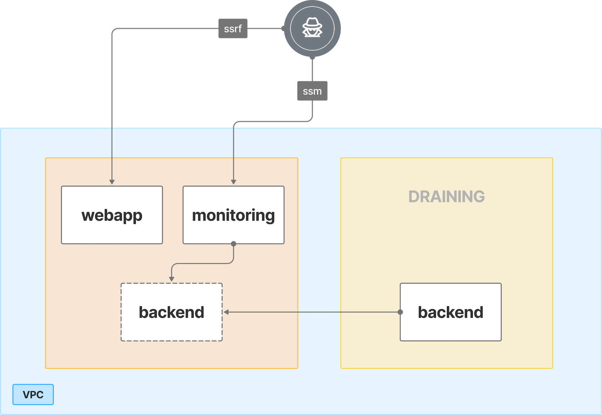

# 8. SSRF to ECS-SSM Pivot & RDS Theft

## 🗺️ Overview
This scenario demonstrates how an SSRF vulnerability in a containerized web application can be chained with overly permissive ECS and SSM privileges to compromise sensitive data in RDS. After exploiting the vulnerable web application to retrieve an EC2 metadata token, the attacker assumes the EC2 role and enumerates ECS tasks, identifying three containers: webapp, monitoring, and backend. Because the backend container runs on a separate EC2 host, the attacker marks that host as DRAINING, forcing the backend to migrate onto the same instance as the monitoring container. They then use SSM to connect into the monitoring container, where Docker socket access allows command execution inside the backend container. From there, the attacker extracts database credentials stored in environment variables and uses them to connect directly to the RDS instance, achieving full database compromise. This chain highlights the compounded risks of SSRF exploitation, insecure container runtime permissions and IAM privilege misuse in ECS environments.

 

## 🧩 Required Resources

**Networking**
- 1 × VPC – Private and public subnets  
- Security Group – Allows database connectivity  

**Compute**
- 2 × EC2 instances - ECS cluster hosts  
- ECS cluster with containers  
- Webapp - Internet-facing, vulnerable to SSRF  
- Monitoring - SSM-enabled, Docker socket access  
- Backend - Stores RDS credentials  

**Database**
- RDS instance - Database credentials stored in backend container  

**IAM / Identities & Access**
- EC2 instance role - ECS and SSM permissions (task listing, draining, Session Manager)  

 

## 🎯 Scenario Goals
Simulate attacker movement from SSRF to ECS compromise, container pivoting, and database credential theft.  

 

## 🖼️ Diagram


 

## 🗡️ Attack Walkthrough
- **Initial Access** - Exploit SSRF in webapp to obtain EC2 metadata token.  
- **Privilege Escalation** - Use token to assume EC2a role with ECS/SSM permissions.  
- **ECS Enumeration** - List ECS tasks; identify three containers: webapp, monitoring, backend.  
- **Container Migration** - Mark EC2b as DRAINING; backend container migrates to EC2a.  
- **SSM Access** - Connect via SSM to monitoring container.  
- **Lateral Movement** - Use Docker socket to exec into backend container.  
- **Credential Discovery** - Extract RDS credentials from backend environment variables.  
- **Database Access** - Connect to RDS instance with discovered credentials.  

 

## 📈 Expected Results
**Successful Completion**
- RDS credentials extracted from container and used for database access.  

**Detection Opportunities**
- ?

 

## 🚀 Getting Started

#### Install Dependencies
macOS
```bash
brew install terraform awscli jq
```
Linux
```bash
sudo apt update && sudo apt install -y terraform awscli jq
```

#### 🏗️ Deploy
Before deploying, download the provided Terraform configuration and attack script to the machine where you will run the attack steps.

Use the provided Terraform configuration to deploy the full lab environment.

At the end of the deployment Terraform will display output values such as the public IP address of the target instance. Save these details, you will need them to run the attack script in the next stage.

⚠️ The environment must allow traffic from the machine where you will execute the attack script. You must explicitly add your IP (or network range) to the whitelist. For example:

```bash
terraform init
terraform apply -var='attack_whitelist=["10.10.10.0/24","20.20.0.0/16"]' -auto-approve
```

#### 🎯 Attack Execution
Execute the attack script from your local terminal and use the output values provided at the end of the deployment as input parameters.

```bash
chmod +x attack.sh
./attack.sh
```

#### 🧹 Clean Up
When you are finished, destroy all resources to avoid ongoing costs. This will tear down the entire lab environment including all compute, networking, and IAM components created during deployment.

Use the following command for a full cleanup

```bash
terraform destroy -var='attack_whitelist=[]' -auto-approve
```
